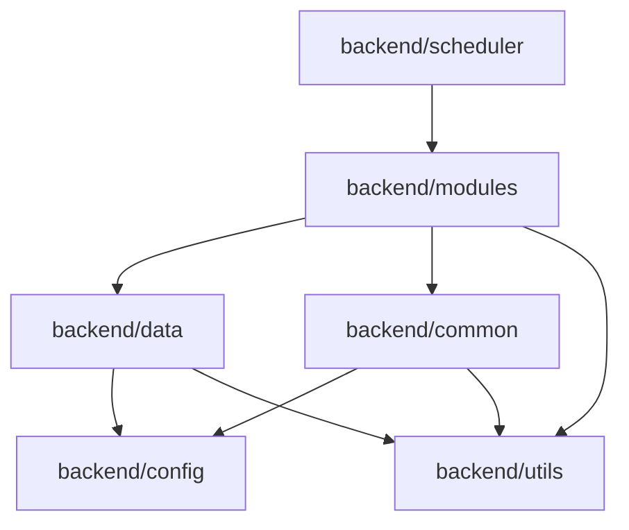

这是一个完全遵循《模块划分规范》的 **Project 3: Logic-Flow (多模态业务编排系统)** 落地实施方案书。

与 Project 2（无状态服务）不同，Project 3 是一个典型的**后台守护进程（Daemon）**与**任务调度系统**。它不需要显卡，运行在 CPU 上，负责“轮询数据 -> 编排逻辑 -> 调用大脑 -> 存储结果”。

---

# 📘 Project 3: Logic-Flow 实施方案书

## 1. 项目概述

**项目代号**：`Logic-Flow`
**核心定位**：系统的“手” —— 业务逻辑编排与执行者。
**职责边界**：
1.  **数据聚合**：主动从 IoTDB 拉取 Project 1（听觉）和 P4（视觉）的时序数据。
2.  **逻辑编排**：负责“时序对齐”、“Prompt 组装”和“结果解析”。
3.  **调度执行**：基于时间窗口（Time Window）的准实时轮询（如每 5 秒分析一次）。
4.  **轻量级**：纯 CPU 运行，不依赖 GPU。

---

## 2. 项目目录结构 (遵循规范)

基于《模块划分规范》，本项目的核心在于 `scheduler`（驱动循环）和 `modules`（具体业务逻辑）。

```text
logic_flow/
├── backend/
│   ├── __init__.py
│   ├── config/                  # [配置层] IoTDB地址、LLM服务地址、阈值配置
│   │   ├── __init__.py
│   │   └── settings.py
│   ├── utils/                   # [工具层] 纯工具函数
│   │   ├── __init__.py
│   │   ├── time_utils.py        # 时间窗口计算、时间戳转换
│   │   └── json_utils.py        # LLM 返回的 JSON 修复与解析
│   ├── data/                    # [数据层] IoTDB 访问封装
│   │   ├── __init__.py
│   │   ├── iotdb_manager.py     # SessionPool 管理
│   │   └── models.py            # 数据结构定义 (AudioEvent, VisualEvent)
│   ├── common/                  # [通用层] 跨模块复用的组件
│   │   ├── __init__.py
│   │   ├── llm_client.py        # 封装对 Project 2 的 HTTP 调用
│   │   └── prompt_builder.py    # 通用的 Prompt 模板管理器
│   ├── modules/                 # [业务模块] 具体的分析场景
│   │   ├── __init__.py
│   │   └── service_quality/     # 场景A：服务质量质检
│   │       ├── __init__.py
│   │       ├── service.py       # 核心逻辑：对齐数据 -> 调LLM -> 存结果
│   │       └── constants.py     # 该业务特有的常量（如违规词库）
│   ├── scheduler/               # [调度层] 系统的心跳
│   │   ├── __init__.py
│   │   └── task_runner.py       # 包含主循环，负责调度各 Modules
│   └── main.py                  # 启动入口
├── scripts/                     # [脚本]
│   └── init_iotdb.sh            # 初始化 IoTDB 存储组
├── requirements.txt
└── Dockerfile
```

---

## 3. 模块详细设计

### 3.1 backend/config/ (配置管理)
**职责**：集中管理外部依赖的地址。

```python
# backend/config/settings.py
from pydantic_settings import BaseSettings

class Settings(BaseSettings):
    # Project 1 & P4 数据源
    IOTDB_HOST: str = "127.0.0.1"
    IOTDB_PORT: int = 6667
    
    # Project 2 大脑地址
    LLM_API_URL: str = "http://localhost:8000/v1/chat/completions"
    LLM_MODEL_NAME: str = "Qwen2.5-7B"
    
    # 调度配置
    POLLING_INTERVAL: int = 5  # 轮询间隔(秒)
    ANALYSIS_WINDOW: int = 10  # 每次分析过去多少秒的数据

settings = Settings()
```

### 3.2 backend/data/ (数据存储访问)
**职责**：封装 IoTDB 的 SessionPool，提供面向对象的读写接口。**严禁包含业务逻辑**。

```python
# backend/data/iotdb_manager.py
from iotdb.SessionPool import SessionPool
from backend.config.settings import settings

class IoTDBManager:
    _instance = None

    def __init__(self):
        self.pool = SessionPool(settings.IOTDB_HOST, settings.IOTDB_PORT, "root", "root", max_size=10)

    @classmethod
    def get_instance(cls):
        if not cls._instance:
            cls._instance = IoTDBManager()
        return cls._instance

    def query_audio_events(self, start_ts: int, end_ts: int):
        """查询指定时间段的音频事件"""
        sql = f"SELECT speaker, content FROM root.store_01.audio.* WHERE time >= {start_ts} AND time < {end_ts}"
        # ... 执行并封装为 List[AudioEvent] 返回 ...
        pass

    def insert_analysis_result(self, timestamp: int, result_json: str):
        """写入分析结果"""
        # ... insert_record ...
        pass
```

### 3.3 backend/common/ (业务通用组件)
**职责**：`LLMClient` 是典型的通用组件，被多个业务模块（如服务质检、安防监控）复用。

```python
# backend/common/llm_client.py
import requests
from backend.config.settings import settings

class LLMClient:
    def analyze(self, system_prompt: str, user_content: str) -> dict:
        """
        调用 Project 2 的标准接口
        """
        payload = {
            "model": settings.LLM_MODEL_NAME,
            "messages": [
                {"role": "system", "content": system_prompt},
                {"role": "user", "content": user_content}
            ],
            "temperature": 0.1, # 分析任务需要低随机性
            "response_format": {"type": "json_object"} # 强制 JSON 输出
        }
        
        try:
            resp = requests.post(settings.LLM_API_URL, json=payload, timeout=10)
            resp.raise_for_status()
            # 解析 content 为 dict
            return self._parse_json(resp.json()['choices'][0]['message']['content'])
        except Exception as e:
            # 记录日志
            return {"error": str(e)}
            
    def _parse_json(self, content):
        # 使用 backend/utils/json_utils.py 进行清洗
        pass
```

### 3.4 backend/modules/ (完整业务功能)
**职责**：这是**核心逻辑**所在。以“服务质量质检”为例，它是一个独立的业务单元。

```python
# backend/modules/service_quality/service.py
from backend.data.iotdb_manager import IoTDBManager
from backend.common.llm_client import LLMClient
from backend.utils.time_utils import get_current_ts

class ServiceQualityAnalyzer:
    def __init__(self):
        self.db = IoTDBManager.get_instance()
        self.llm = LLMClient()

    def execute_analysis(self, start_ts, end_ts):
        # 1. 获取多模态数据 (Data Layer)
        audio_records = self.db.query_audio_events(start_ts, end_ts)
        visual_records = self.db.query_visual_events(start_ts, end_ts)
        
        if not audio_records and not visual_records:
            return # 无事发生
            
        # 2. 业务逻辑：数据对齐与 Prompt 构建
        # 将零散的记录拼接成自然语言描述
        context_str = self._build_context(audio_records, visual_records)
        
        system_prompt = """
        你是一个门店质检员。请根据视听记录判断：
        1. 员工是否使用了欢迎语？
        2. 顾客是否表现出购买意向？
        输出 JSON: {"welcome_used": bool, "purchase_intent": bool}
        """
        
        # 3. 调用大脑 (Common Layer)
        result = self.llm.analyze(system_prompt, context_str)
        
        # 4. 结果持久化 (Data Layer)
        self.db.insert_analysis_result(end_ts, str(result))
        
        return result

    def _build_context(self, audio, visual):
        # ... 拼接逻辑 ...
        return f"在{len(audio)}条语音中..."
```

### 3.5 backend/scheduler/ (系统协调管理)
**职责**：系统的“心脏”，负责按节奏驱动各个 Modules 工作。

```python
# backend/scheduler/task_runner.py
import time
import schedule
from backend.modules.service_quality.service import ServiceQualityAnalyzer
from backend.config.settings import settings
from backend.utils.time_utils import get_current_ts

class TaskRunner:
    def __init__(self):
        self.quality_service = ServiceQualityAnalyzer()
        # 可以添加更多模块，如 self.security_service = ...

    def job(self):
        """周期性任务"""
        now = get_current_ts()
        # 分析过去 N 秒的数据
        start_ts = now - (settings.ANALYSIS_WINDOW * 1000)
        end_ts = now
        
        print(f"⏰ 开始分析窗口: {start_ts} - {end_ts}")
        self.quality_service.execute_analysis(start_ts, end_ts)

    def start(self):
        # 每 N 秒执行一次
        schedule.every(settings.POLLING_INTERVAL).seconds.do(self.job)
        
        print("🚀 Logic-Flow 调度器已启动...")
        while True:
            schedule.run_pending()
            time.sleep(1)
```

---

## 4. 核心依赖关系图

遵循规范中的依赖规则：



*   **Scheduler** 处于顶层，依赖 Modules。
*   **Modules** 包含业务逻辑，调用 Data 和 Common。
*   **Data** 和 **Common** 互不依赖，处于同一层级。
*   **Utils** 处于最底层。

---

## 5. 部署与运行

### 5.1 环境准备 (requirements.txt)
```text
requests
iotdb-session
schedule
pydantic-settings
```

### 5.2 启动脚本 (backend/main.py)
```python
from backend.scheduler.task_runner import TaskRunner

if __name__ == "__main__":
    runner = TaskRunner()
    runner.start()
```

### 5.3 运行方式
由于 Project 3 极度轻量，建议直接作为 Docker 容器运行，或者使用 `nohup` 在后台运行。

```bash
# 启动命令
python -m backend.main
```

---

## 6. 总结

该方案完全符合《模块划分规范》：
*   **backend/scheduler**: 明确了这是一个任务驱动的系统，而不是被动的 Web 服务。
*   **backend/modules**: 将“服务质检”封装为独立模块，未来如果要加“安防报警”，只需新增 `backend/modules/security/`，无需修改现有代码。
*   **backend/common**: 抽离了 `LLMClient`，确保所有业务模块使用统一的方式访问 Project 2。

至此，你的三个项目（Project 1 耳朵、Project 2 大脑、Project 3 手）均已具备完整的、符合规范的实施方案。